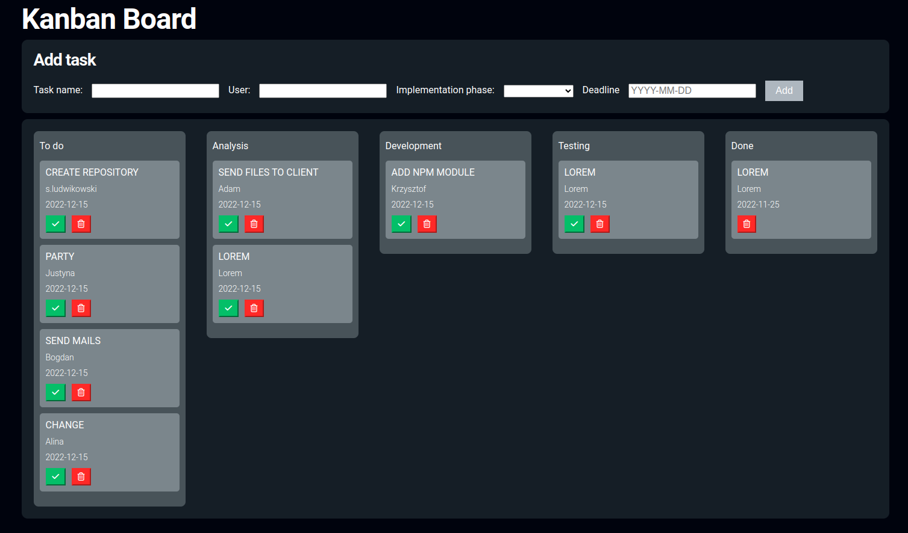

# Kanban Board

A kanban board is an agile project management tool designed to help visualize work, limit work-in-progress, and maximize efficiency (or flow), is used in many companies. More about Kaban [here](https://kanbanblog.com/explained/). In this repository I built a simple Kaban board. The app uses modern React features including Hooks and Context API.


Project functionality: 
- create task with description;
- asign a person to the task;
- move tasks between columns with defined limits; 
- save tasks to local storage;
- clear tasks from the Local Storage.

**Main features**:
- React
&nbsp;
 
## 💡 Technologies


&nbsp;
 
## 💿 Installation

The project uses [node](https://nodejs.org/en/) and [npm](https://www.npmjs.com/). 
&nbsp;

To run it locally you should install all dependencies:

    npm i

To run webpack and create a localhost port you should type:

    npm start


&nbsp;

## 🤔 Solutions provided in the project

1. Columns are rendered dynamically. The app follows the rules you specify.
```
const init = {
  columns: [
    { id: 1, name: 'To do', limit: 5 },
    { id: 2, name: 'Analysis', limit: 3 },
    { id: 3, name: 'Development', limit: 5 },
    { id: 4, name: 'Testing', limit: 3 },
    { id: 5, name: 'Done', limit: 10 }
  ],
  tasks: []
```

2. LocalStorage enables the app to store the data inside it. I created my custom hook called useStorage to handle data saving. 
```
export const useStorage = () => {
  const setItem = (ob, name) => {
    localStorage.setItem(name, JSON.stringify(ob))
  }
  const getItem = (name) => {
    const retrivedObject = JSON.parse(localStorage.getItem(name))
    return retrivedObject
  }

  return [getItem, setItem]
}

```
&nbsp;
 
<h1 align="center">Hi , I'm Szymon </h1>
<h4 align="center">I am looking for my first professional experience.</h4>

 <h3>Connect with me:</h3>

[](https://www.linkedin.com/in/sludwikowski) 
[](https://www.facebook.com/szymonludwikowskii/)


&nbsp;

## 👏 Thanks / Special thanks / Credits

To  [Akademia Samouka](https://akademiasamouka.pl/) 
